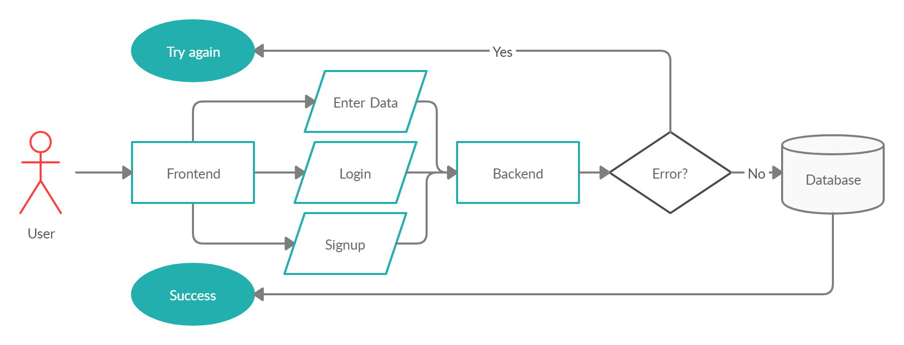

# Program Organization

# Major Classes

# Data Design

# Business Rules
In terms of business rules, the application follows one rule. In order to protect the users' privacy, the application encrypts their passwords.

# User Interface Design

# Resource Management
The application draws information and data for predictions from a database populated with official data from the university catalogs. Building from the catalogs allows for easy management as the database needs to only be updated with each catalog year update. The application will store up users into a user database and courses into a major and course database. The application needs to account for such dynamic additions.

# Security
As stated in the business rules, the application probably will only contain one aspect of needed protection-the privacy of the user. Using password encryption, in the form of Bcrypt, for each user added, protects their information.

# Performance
The application should provide instruction throughout the process in prompting the user,making the application as easy to use as possible, in theory. Though the speed Vs. memory Vs. cost tadeoff isn't finalized at this stage of production, we believe that given our design and organization of the process allows for smooth user ineraction with the application. We believe this is possible through linked simple front end design and databases in the backend using Microsoft Azure, MongoDb, Node js, etc.. Thus, the goal is the plausibility of a reasonably fast course prediction planner.

# Scalability
Because the application is being developed using the scaffolding, bottom-up, approach, most of the project is broken up into functionalities to be created from most fundamental to parts of mere extremety status. The user and major/course databases should be dynamic in the sense that they new entries can e created and added, as well as removals, and updates, etc..

# Interoperability
The application does make use of interoperability as the website backend is connected to a database containing the specific majors and courses. The backend will access the information through  a series of API calls. 

# Internationalization/Localization
The application will be able to hot multiple locals through the use of Microsoft Azure, which deploys the source code to a remote server that is linked to a URL that can be accessed locally.

# Input/Output
The input for this program will use a look-ahead reading scheme.  The input will also be event driven with the user interacting with the system through the website front-end.  Input devices will most likely be a keyboard and mouse for entering data and navigating the site, although a touch display may also be used if the site is accessed from a mobile device.  

The output of this program will also be through the website front-end, with information being rendered and displayed to the user through a screen.  For example, when suggesting courses to the user based on their major, the courses will be sent from the backend and rendered to the screen by the front end.
I/O errors will be handled by the backend, as the backend will be accessing the database and will be the first to know if an error was made in the input.  When errors are detected by the backend it will respond to the front end with the error which will be passed to the user.

# Error Processing

The error processing for this system will take place in the backend of the website.  We will use an active detective approach with incoming input.  If input is not what we expect, we will anticipate common cases where a user might miss a field or type something wrong to give them helpful error messages so they can fix their mistake.  As shown in the diagram, if an error is detected in the backend, the error is propagated to the frontend to be displayed to the user while the database is not accessed.

In all other error cases, each class is responsible for checking data coming in and keeping track of its own errors.  If an error is detected at any point, the current action will be halted and the error will be propagated to the user.  

# Fault Tolerance
The fault tolerance of this system will be very high, as the user will only be navigate the site using built in buttons and sliders.  In the cases where input text is needed, the system will reject anything that is not formatted correctly so it will be very unlikely to encounter a scenario where the system would crash.  There should be very little opportunity for the user to make errors when using the system.

# Architectural Feasibility
The application is able to be feasbily run due to extenseive testing to make sure that all of the components are properly connected and are able to recieve the data. The website backend and database in particular have been tested to ake sure that the information is sent and that it is accurate.

# Overengineering
The robustness of a program is its ability to cope with errors during execution. Architecture often leans towards a more robust system that includes overengineering, but our application is focused on doing the simplest thing that works. In order to implement this we have broken up the functionality of our program into concise parts. This allows for each aspect to be tested easily, which leads to a more reliable program overall.

# Build-vs-Buy Decisions
Our team has taken the build approach when creating our software. This is mainly because our application is created for academic and learning purposes, so the majority of our code is supposed to be our own work. Moreover, we do not have a budget to buy additional resources. However, we have utilized a lot of free open-source software throughout our application.

We have chosen a MEAN tech stack with typescript for this project. For our back end development we use Express to facilitate making an API, Node which is our runtime environment for javascript, MongoDB to implement our no SQL database, and bcrypt which allows us to hash passwords. For the front end we use Angular which aids us in expressing our application’s components clearly and succinctly. For testing we use the Jasmine testing framework.

# Reuse
This application does not call for the reuse of any preexisting software, test cases, data formats, or other materials. 

# Change Strategy
Our application is being created and developed using scaffolding, which means that we are starting with the very basics and then building up the features from there. Given this, our product will go through changes after each sprint which will allow our product to have new capabilities and functionality. We will manage these changes using git which lets us track changes as commits and facilitates version control.
