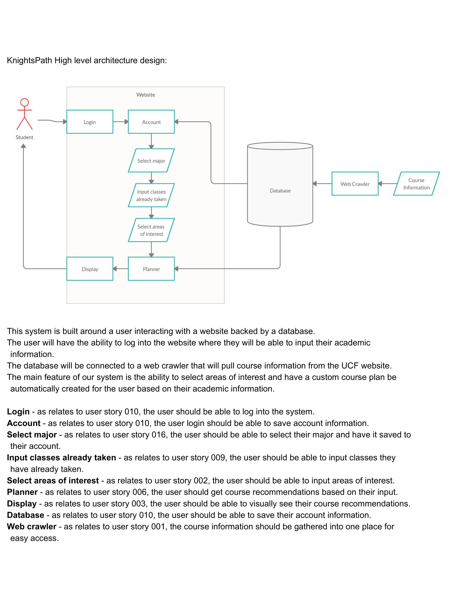
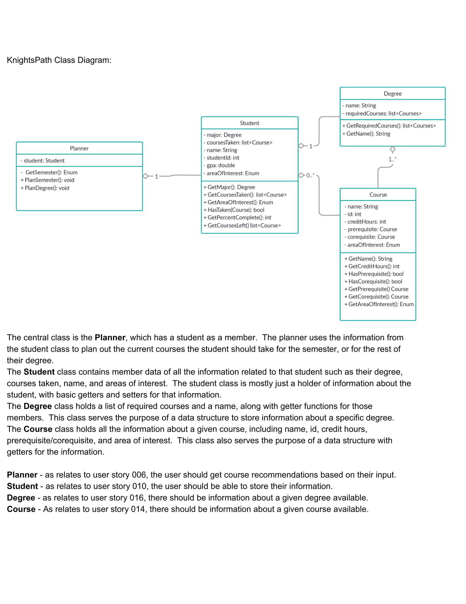
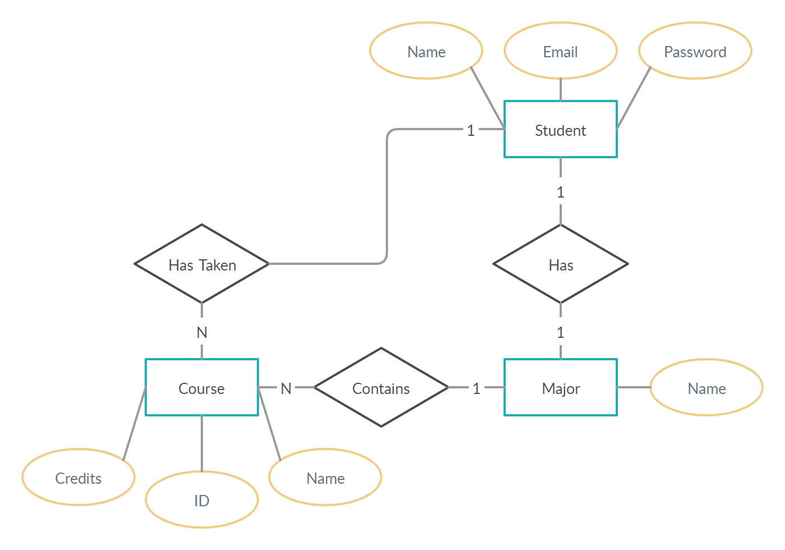
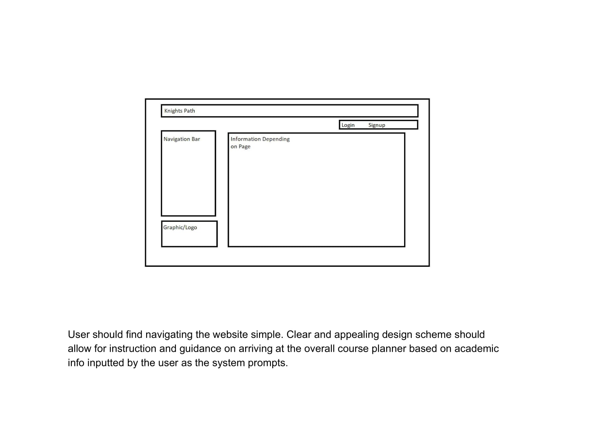

# Program Organization

# Major Classes

# Data Design

# Business Rules

# User Interface Design

# Resource Management

# Security

# Performance

# Scalability

# Interoperability

# Internationalization/Localization

# Input/Output

# Error Processing

# Fault Tolerance

# Architectural Feasibility

# Overengineering

# Build-vs-Buy Decisions

# Reuse

# Change Strategy
